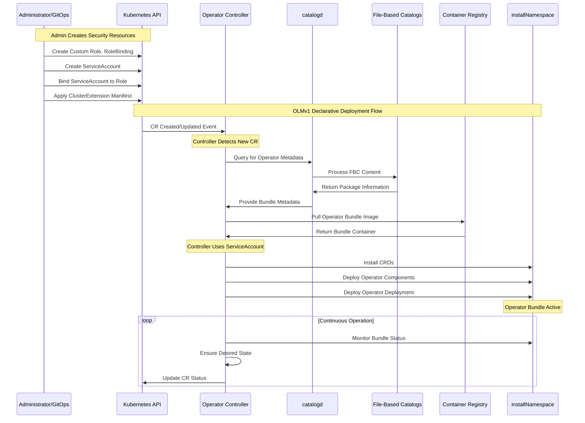

# Operator Lifecycle Manager V1 (OLMv1)

## Table of Contents

- [Overview](#overview)
- [Architecture](#architecture)
- [Key Components](#key-components)
- [Deployment Flow](#deployment-flow)
- [Sequence Diagram](#sequence-diagram)
- [Project Structure](#project-structure)
- [Deployment Documentation](#deployment-documentation)
- [Command Reference](#command-reference)
  - [Package Discovery](#package-discovery)
  - [Channel Information](#channel-information)
  - [Version Queries](#version-queries)
  - [Bundle Filtering](#bundle-filtering)
  - [OLMv1 Compatibility](#olmv1-compatibility)
  - [Permission Analysis](#permission-analysis)

## Overview

The Operator Lifecycle Manager V1 (OLMv1) is a declarative, pull-based system designed for managing Kubernetes operators with a focus on simplicity and security. This document provides a comprehensive guide to understanding OLMv1's architecture, deployment flow, and practical usage.

## Architecture

OLMv1 follows a declarative architecture where administrators define desired states through Custom Resources, and the system automatically orchestrates operator lifecycles. The architecture is built around several core components that work together to provide a robust operator management solution.

## Key Components

| Component | Description | Purpose |
|-----------|-------------|---------|
| **Administrator/GitOps Tool** | Human operator or automation tool | Creates ClusterExtension CRs to define desired operator states |
| **Operator Controller** | Core OLMv1 component | Watches ClusterExtension CRs and orchestrates operator lifecycle |
| **catalogd** | Metadata service | Hosts and serves operator metadata from File-Based Catalogs |
| **File-Based Catalogs (FBCs)** | Lightweight metadata collections | Source of truth for operator bundles, channels, and update graphs |
| **Installed Operator Bundle** | Deployed operator resources | Includes deployment, ServiceAccount, RBAC, and CRDs |

## Deployment Flow

The OLMv1 deployment process follows a logical sequence:

1. **Administrator Action**: Apply a declarative `ClusterExtension` manifest specifying the desired operator package, version, and target namespace
2. **Controller Detection**: The Operator Controller detects the new `ClusterExtension` CR
3. **Metadata Query**: Controller queries `catalogd` for the requested operator bundle
4. **Catalog Response**: `catalogd` provides metadata from File-Based Catalogs
5. **Bundle Deployment**: Controller pulls and deploys the operator bundle components
6. **Active Operation**: Operator begins operation with least-privilege access

## Sequence Diagram



## Project Structure

This project provides a structured approach for deploying OLMv1 operators with proper security and RBAC configuration:

```tree
OLMv1/
├── README.md                           # This documentation
├── bundle/                             # Operator bundle files
│   ├── ClusterServiceVersion.json      # Quay operator CSV
│   ├── Service.json                    # Quay operator service
│   └── CustomResourceDefinition.json   # Quay operator CRD
├── examples/                           # Example operator implementations
│   ├── helm/                          # Generic Helm chart for operators
│   │   ├── Chart.yaml                 # Helm chart metadata
│   │   ├── values.yaml                # Helm chart values
│   │   ├── .helmignore                # Helm ignore patterns
│   │   └── templates/                 # Helm chart templates
│   │       ├── clusterextension.yaml
│   │       ├── clusterrole.yaml
│   │       ├── clusterrolebinding.yaml
│   │       └── serviceaccount.yaml
│   ├── values/                        # Example values files for different operators
│   ├── yamls/                         # Manual YAML deployment files
│   │   ├── 00-namespace.yaml           # Namespace definition
│   │   ├── 01-serviceaccount.yaml      # Service account for operator
│   │   ├── 02-clusterrole.yaml         # Cluster role with least privilege
│   │   ├── 03-clusterrolebinding.yaml  # Cluster role binding
│   │   └── 04-clusterextension.yaml    # OLMv1 ClusterExtension
│   └── DEPLOYMENT.md                   # Detailed deployment documentation
├── Templates/                          # Reusable template files
│   └── CustomRoles/                    # Custom role templates
│       ├── 00-rolebinding.yaml        # Role binding template
│       ├── 01-clusterrole.yaml        # Cluster role template
│       └── 02-clusterrolebinding.yaml # Cluster role binding template
├── .git/                               # Git repository
├── .gitignore                          # Git ignore patterns
├── .cursor/                            # Cursor IDE configuration
└── .cursorignore                       # Cursor ignore patterns
```

## Deployment Documentation

For detailed deployment instructions, including step-by-step processes, cleanup procedures, and Helm chart usage, see the comprehensive [Deployment Guide](examples/DEPLOYMENT.md).

The guide covers:

- **Step-by-step deployment** of operators using YAML manifests
- **Helm chart deployment** for simplified operator installation
- **Cleanup procedures** for removing operators and resources
- **Monitoring and verification** steps for successful deployments

## Using Templates

The `Templates/CustomRoles/` directory contains reusable templates for custom RBAC configurations that can be adapted for different operators.

## Command Reference

This section provides practical commands for interacting with OLMv1 catalogs and analyzing operator bundles. Most commands use the `opm` tool, but equivalent `catalogd` interactions are also shown.

### Package Discovery

**Get all available packages within a catalog:**

```bash
# Using opm with container registry
opm render registry.redhat.io/redhat/redhat-operator-index:v4.18 \
  | jq -s '.[] | select(.schema == "olm.package") | .name'

# Using catalogd via OpenShift route
curl -k https://catalogd.apps.example.com/catalogs/openshift-redhat-operators/api/v1/all \
  | jq -s '.[] | select(.schema == "olm.package") | .name'
```

### Channel Information

**Query available channels for a specific operator:**

```bash
opm render registry.redhat.io/redhat/redhat-operator-index:v4.18 \
  | jq -s '.[] | select(.schema == "olm.channel") | select(.package == "quay-operator") | .name'
```

### Version Queries

**Query available versions for each channel:**

```bash
opm render registry.redhat.io/redhat/redhat-operator-index:v4.18 \
  | jq -s '.[] | select(.schema == "olm.channel") | select(.package == "quay-operator") |
  { 
    "Channel": .name,
    "Versions": [.entries[].name] | sort
  }'
```

### Bundle Filtering

**Query specific bundle using package and version filters:**

```bash
opm render registry.redhat.io/redhat/redhat-operator-index:v4.18 \
  | jq -s '.[] 
  | select(.schema == "olm.bundle" and any(.properties[] ; .type == "olm.package" and .value.packageName == "quay-operator" and .value.version == "3.10.13"))'
```

### OLMv1 Compatibility

**Check if operator is compatible with OLMv1 (InstallMode == AllNamespaces):**

```bash
opm render registry.redhat.io/redhat/redhat-operator-index:v4.18 \
  | jq -s '.[] | select(.schema == "olm.bundle" and any(.properties[] ; .type == "olm.package" and .value.packageName == "quay-operator" and .value.version == "3.10.13")) | {
    name,
    image,
    SupportAllNamespaces: (.properties[] | select(.type == "olm.csv.metadata").value.installModes[] | select(.type == "AllNamespaces").supported)
  }'
```

### Permission Analysis

**Note**: When analyzing operator permissions, always review both `clusterPermissions` and `permissions` sections. The Quay operator example above only shows `permissions` as it doesn't include `clusterPermissions`.

**Query required permissions for an operator:**

```bash
# Basic permission extraction
opm render registry.redhat.io/quay/quay-operator-bundle@sha256:c431ad9dfd69c049e6d9583928630c06b8612879eeed57738fa7be206061fee2 \
  | jq -r '.properties[] | select(.type == "olm.bundle.object") | .value.data' \
  | base64 -d \
  | jq 'select(.kind == "ClusterServiceVersion") | .spec.install.spec.permissions[].rules[]' \
  | jq -s '.'
```

**Export permissions as a Kubernetes Role YAML:**

```bash
opm render registry.redhat.io/quay/quay-operator-bundle@sha256:c431ad9dfd69c049e6d9583928630c06b8612879eeed57738fa7be206061fee2 \
  | jq -r '.properties[] | select(.type == "olm.bundle.object") | .value.data' \
  | base64 -d \
  | jq -s 'map(select(.kind == "ClusterServiceVersion")) | .[].spec.install.spec.permissions[].rules[]' \
  | jq -s '.' \
  | yq -P '{"apiVersion": "rbac.authorization.k8s.io/v1", "kind": "Role", "metadata": {"name": "example", "namespace": "example-ns"}, "rules": .}'
```
