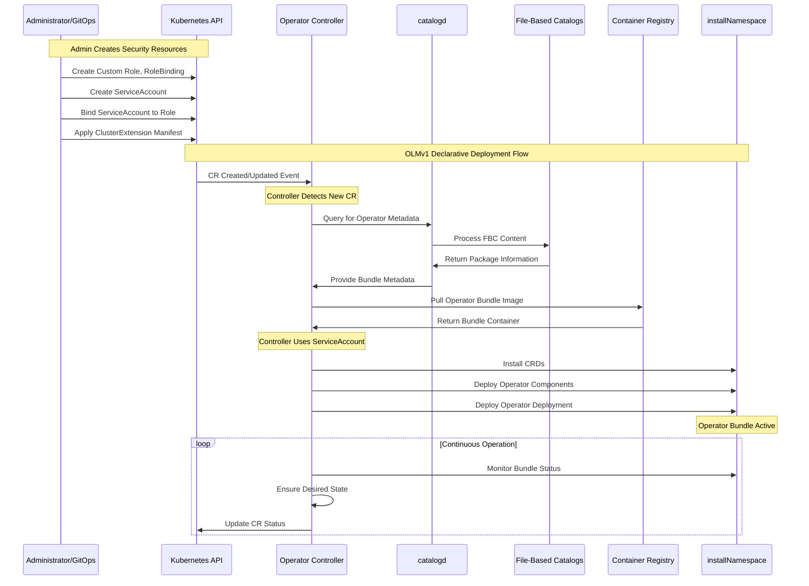

# Operator Life cycle manager V1

```mermaid
sequenceDiagram
    participant Admin as Administrator/GitOps
    participant API as Kubernetes API
    participant OC as Operator Controller
    participant CD as catalogd
    participant FBC as File-Based Catalogs
    participant Registry as Container Registry
    participant NS as installNamespace
    Note over Admin,API: Admin Creates Security Resources
    Admin->>API: Create Custom Role, RoleBinding
    Admin->>API: Create ServiceAccount
    Admin->>API: Bind ServiceAccount to Role
    Admin->>API: Apply ClusterExtension Manifest
    Note over API,NS: OLMv1 Declarative Deployment Flow
    API->>OC: CR Created/Updated Event
    Note over OC: Controller Detects New CR
    OC->>CD: Query for Operator Metadata
    CD->>FBC: Process FBC Content
    FBC->>CD: Return Package Information
    CD->>OC: Provide Bundle Metadata
    OC->>Registry: Pull Operator Bundle Image
    Registry->>OC: Return Bundle Container
    Note over OC: Controller Uses ServiceAccount
    OC->>NS: Install CRDs
    OC->>NS: Deploy Operator Components
    OC->>NS: Deploy Operator Deployment
    Note over NS: Operator Bundle Active
    loop Continuous Operation
        OC->>NS: Monitor Bundle Status
        OC->>OC: Ensure Desired State
        OC->>API: Update CR Status
    end
```
