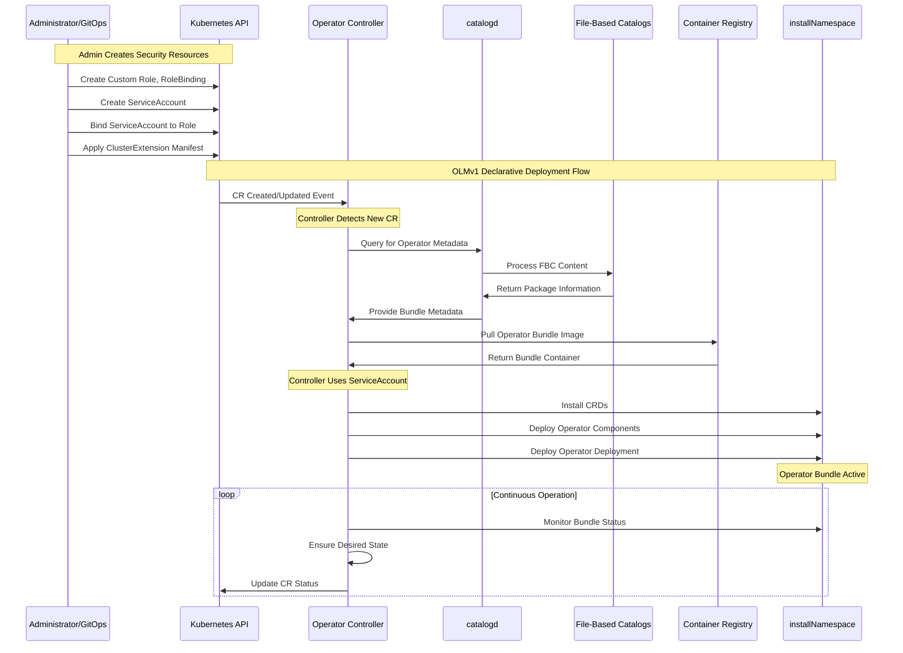

# Operator Lifecycle Manager V1 (OLMv1)

> **Disclaimer**: This repo contains AI-generated content using Cursor / Gemini AI.

## Table of Contents

- [Overview](#overview)
- [Architecture](#architecture)
- [Key Components](#key-components)
- [Deployment Flow](#deployment-flow)
- [Sequence Diagram](#sequence-diagram)
- [Project Structure](#project-structure)
- [Deployment Documentation](#deployment-documentation)
- [Using Templates](#using-templates)
- [RBAC Manager Tool](#rbac-manager-tool)
- [Documentation](#documentation)

## Overview

The Operator Lifecycle Manager V1 (OLMv1) is a declarative, pull-based system designed for managing Kubernetes operators with a focus on simplicity and security. This repository provides a comprehensive guide to understanding OLMv1's architecture, deployment flow, and practical usage.
for more information visit the official documentation [openshift/operator-framework-operator-controller](https://github.com/openshift/operator-framework-operator-controller)

## Architecture

OLMv1 follows a declarative architecture where administrators define desired states through Custom Resources, and the system automatically orchestrates operator lifecycles. The architecture is built around several core components that work together to provide a robust operator management solution.

## Key Components

| Component | Description | Purpose |
|-----------|-------------|---------|
| **Operator Controller** | Core OLMv1 component | Watches ClusterExtension CRs and orchestrates operator lifecycle |
| **catalogd** | Metadata service | Hosts and serves operator metadata from File-Based Catalogs |
| **File-Based Catalogs (FBCs)** | Lightweight metadata collections | Source of truth for operator bundles, channels, and update graphs |

## Deployment Flow

The OLMv1 deployment process follows a logical sequence:

1. **Administrator Action**: Apply a declarative `ClusterExtension` manifest specifying the desired operator package, version, and target namespace
2. **Controller Detection**: The Operator Controller detects the new `ClusterExtension` CR
3. **Metadata Query**: Controller queries `catalogd` for the requested operator bundle
4. **Catalog Response**: `catalogd` provides metadata from File-Based Catalogs
5. **Bundle Deployment**: Controller pulls and deploys the operator bundle components
6. **Active Operation**: Operator begins operation with optimized RBAC permissions

## Sequence Diagram



## Project Structure

This project provides a structured approach for deploying OLMv1 operators with proper security and RBAC configuration:

```tree
OLMv1/
├── .github/                           # GitHub-specific configuration
├── docs/                              # Project documentation
├── examples/                          # Example configurations and use cases
├── helm/                             # Helm chart for OLMv1 deployment
├── templates/                        # Kubernetes resource templates
├── tests/                            # Test files and test results
├── tools/                            # Development and management tools
├── config/                           # Configuration files (future use)
├── scripts/                          # Utility scripts (future use)
├── workflows/                        # Workflow definitions (future use)
└── README.md                         # This documentation
```

## Deployment Documentation

For detailed deployment instructions, including step-by-step processes, cleanup procedures, and Helm chart usage, see the comprehensive [Deployment Guide](docs/DEPLOYMENT.md).

The guide covers:

- **Step-by-step deployment** of operators using YAML manifests
- **Helm chart deployment** for simplified operator installation
- **Cleanup procedures** for removing operators and resources
- **Monitoring and verification** steps for successful deployments

## Using Templates

The `templates/` directory contains reusable templates for custom RBAC configurations that can be adapted for different operators.

## RBAC Manager Tool

The project includes an RBAC Manager tool that automates the extraction and processing of RBAC permissions from operator bundles. This tool simplifies the process of creating proper security configurations for OLMv1 deployments.

### Key Features

- **Catalog Discovery**: List and query available operators from cluster catalogs
- **Smart RBAC Extraction and Generation**: Extract RBAC permissions from operator bundle images and generate appropriate ClusterRoles and Roles based on operator requirements
- **Multiple Output Formats**: Support for both Kubernetes YAML manifests and Helm values
- **Configuration Management**: Generate and reuse configuration files for consistent deployments

### Integration with OLMv1 Workflow

1. **Discover Operators**: Query available catalogs and packages
2. **Generate Configuration**: Create reusable configuration templates
3. **Extract RBAC**: Generate required permissions for your chosen operator
4. **Review Permissions**: Examine the generated RBAC to ensure it meets security requirements
5. **Deploy RBAC**: Apply the RBAC resources before deploying the ClusterExtension
6. **Deploy Operator**: Use the generated ServiceAccount in your ClusterExtension manifest

For comprehensive usage instructions and examples, see the [RBAC Manager Documentation](tools/rbac-manager/README.md).

## Documentation

This project includes comprehensive documentation to help you understand and use OLMv1 effectively:

### Core Documentation

- **[Deployment Guide](docs/DEPLOYMENT.md)**: Step-by-step instructions for deploying operators with OLMv1
- **[Manual Command Reference](docs/COMMAND_REFERENCE.md)**: Manual OPM render and curl commands for advanced users and automation

### Tool Documentation

- **[RBAC Manager Tool](tools/rbac-manager/README.md)**: Automated RBAC extraction and management with configuration support

### Quick References

- **Package Discovery**: Use `opm render` or catalogd API to find available operators
- **RBAC Extraction**: Leverage the RBAC Manager tool for automated permission analysis
- **Deployment**: Follow the deployment guide for production-ready operator installations
- **Troubleshooting**: Check the command reference for debugging techniques

> **💡 Tip**: For easier operator management, start with the [RBAC Manager Tool](tools/rbac-manager/) which automates many manual processes and provides a user-friendly interface for OLMv1 workflows.
