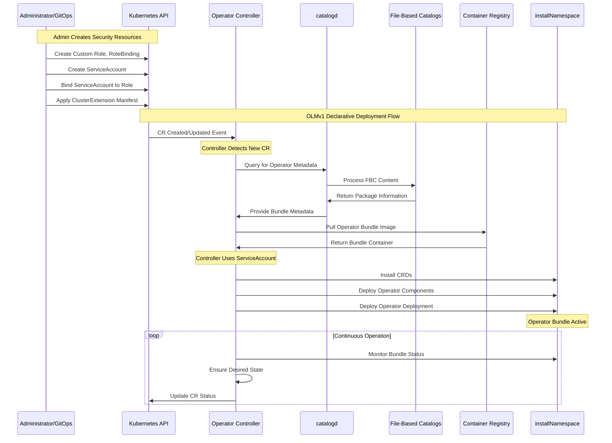

# Operator Life cycle manager V1

## OLMv1 Architecture Flow

The OLMv1 architecture is designed around a declarative, pull-based model that prioritizes simplicity and security. The following diagram illustrates the primary components and the flow of a typical Operator deployment.
Key Architectural Components:

* Administrator / GitOps Tool: The starting point for any OLMv1 operation. This entity defines the desired state by creating a ClusterExtension Custom Resource (CR).
* Operator Controller: The core of OLMv1. It continuously watches for ClusterExtension CRs and orchestrates the Operator's lifecycle. It uses catalogd to find the correct Operator metadata and deploys the necessary resources.
* catalogd: A service that hosts and serves metadata for Kubernetes extensions. It processes the content of File-Based Catalogs (FBCs) to provide a single, searchable source for all available Operator packages and versions.
* File-Based Catalogs (FBCs): The source of truth for Operator metadata. These are lightweight, text-based (JSON/YAML) collections of Operator bundles, channels, and update graphs, packaged as container images.
* Installed Operator Bundle: The result of a successful OLMv1 installation. This includes the Operator's deployment, a dedicated ServiceAccount, and its associated Role-Based Access Controls (RBAC), all deployed to a specific installNamespace as defined in the ClusterExtension CR.

## Deployment Flow

The process of deploying an Operator with OLMv1 follows this logical sequence:

1. An administrator or a GitOps tool applies a declarative ClusterExtension manifest to the cluster. This manifest specifies the desired Operator package, version, and the target namespace for installation.
2. The Operator Controller detects the new ClusterExtension CR.
3. The Operator Controller queries catalogd to find the requested Operator bundle.
4. catalogd provides the metadata from its File-Based Catalogs, including the correct container image and manifest for the specified version.
5. The Operator Controller pulls the Operator bundle and deploys its components—including the deployment, CRDs, and a dedicated ServiceAccount—into the designated installNamespace.
6. The deployed Operator Bundle begins its work, operating with the least privilege necessary, as defined by its specific ServiceAccount and RBAC.



## Commands

Using ‘jq’ or 'yq' tool to parse the output, and ‘opm’ or ‘curl’ to interact with the container registry image or the ClusterCatalog(Expose the service with a passthrough route)
**Note:** Most of the command are shown with opm, however interaction with catalogd using the same filter should work as well.

1. Get all available packages within a catalogd or image catalog.

```bash
opm render registry.redhat.io/redhat/redhat-operator-index:v4.18 \
  | jq -s '.[] | select( .schema == "olm.package") | .name'

#Openshift Route
curl -k https://catalogd.apps.example.com/catalogs/openshift-redhat-operators/api/v1/all \
  | jq -s '.[] | select( .schema == "olm.package") | .name'
```

2. Query available channels for an operator.

```bash
opm render registry.redhat.io/redhat/redhat-operator-index:v4.18 \
  | jq -s '.[] | select( .schema == "olm.channel") | select( .package == "quay-operator") | .name'
```

3. Querry available versions for each channel.

```bash
opm render registry.redhat.io/redhat/redhat-operator-index:v4.18 \
  | jq -s '.[] | select(.schema == "olm.channel") | select(.package == "quay-operator") | 
  { 
    "Channel": .name,
    "Versions": [.entries[].name] | sort
  }
'
```

4. Query spefific bundle using package and package version filters.

```bash
opm render registry.redhat.io/redhat/redhat-operator-index:v4.18 \
  | jq -s '.[] 
  | select( .schema == "olm.bundle" and any(.properties[] ; .type == "olm.package" and .value.packageName == "quay-operator" and .value.version == "3.10.13"))'
```

5. Query to see if the operator is comptaible with OLMv1 (InstallMode == AllNamespaces)

```bash
opm render registry.redhat.io/redhat/redhat-operator-index:v4.18 | jq -s '.[] | select( .schema == "olm.bundle" and any(.properties[] ; .type == "olm.package" and .value.packageName == "quay-operator" and .value.version == "3.10.13")) | {name, image, SupportAllNamespaces: (.properties[] | select(.type == "olm.csv.metadata").value.installModes[] | select(.type == "AllNamespaces").supported)
```

6.Query the required permissions by the opearator.
**Note:** clusterPermissions and permissions should be reviewed.

For Quay .spec.clusterPermissions doesn't exist.

```bash
opm render registry.redhat.io/quay/quay-operator-bundle@sha256:c431ad9dfd69c049e6d9583928630c06b8612879eeed57738fa7be206061fee2 \
  | jq -r '.properties[] | select(.type == "olm.bundle.object") | .value.data' \
  | base64 -d \
  | jq 'select(.kind == "ClusterServiceVersion") | .spec.install.spec.permissions[].rules[]' \
  | jq -s '.'
```

Export into a YAML:

```bash
opm render registry.redhat.io/quay/quay-operator-bundle@sha256:c431ad9dfd69c049e6d9583928630c06b8612879eeed57738fa7be206061fee2 \
  | jq -r '.properties[] | select(.type == "olm.bundle.object") | .value.data' \
  | base64 -d \
  | jq -s 'map(select(.kind == "ClusterServiceVersion")) | .[].spec.install.spec.permissions[].rules[]' \
  | jq -s '.' \
  | yq -P '{"apiVersion": "rbac.authorization.k8s.io/v1", "kind": "Role", "metadata": {"name": "example", "namespace": "example-ns"}, "rules": .}'
```

*Output:*

```yaml
apiVersion: rbac.authorization.k8s.io/v1
kind: Role
metadata:
  name: example
  namespace: example-ns
rules:
  - apiGroups:
      - quay.redhat.com
    resources:
      - quayregistries
      - quayregistries/status
    verbs:
      - '*'
  - apiGroups:
      - apps
    resources:
      - deployments
    verbs:
      - '*'
  - apiGroups:
      - ""
    resources:
      - pods
      - services
      - secrets
      - configmaps
      - serviceaccounts
      - persistentvolumeclaims
      - events
    verbs:
      - '*'
  - apiGroups:
      - ""
    resources:
      - namespaces
    verbs:
      - get
      - watch
      - list
      - update
      - patch
  - apiGroups:
      - rbac.authorization.k8s.io
    resources:
      - roles
      - rolebindings
    verbs:
      - '*'
  - apiGroups:
      - route.openshift.io
    resources:
      - routes
      - routes/custom-host
    verbs:
      - '*'
  - apiGroups:
      - autoscaling
    resources:
      - horizontalpodautoscalers
    verbs:
      - '*'
  - apiGroups:
      - objectbucket.io
    resources:
      - objectbucketclaims
    verbs:
      - '*'
  - apiGroups:
      - monitoring.coreos.com
    resources:
      - prometheusrules
      - servicemonitors
    verbs:
      - '*'
  - apiGroups:
      - batch
    resources:
      - jobs
    verbs:
      - '*'
```
