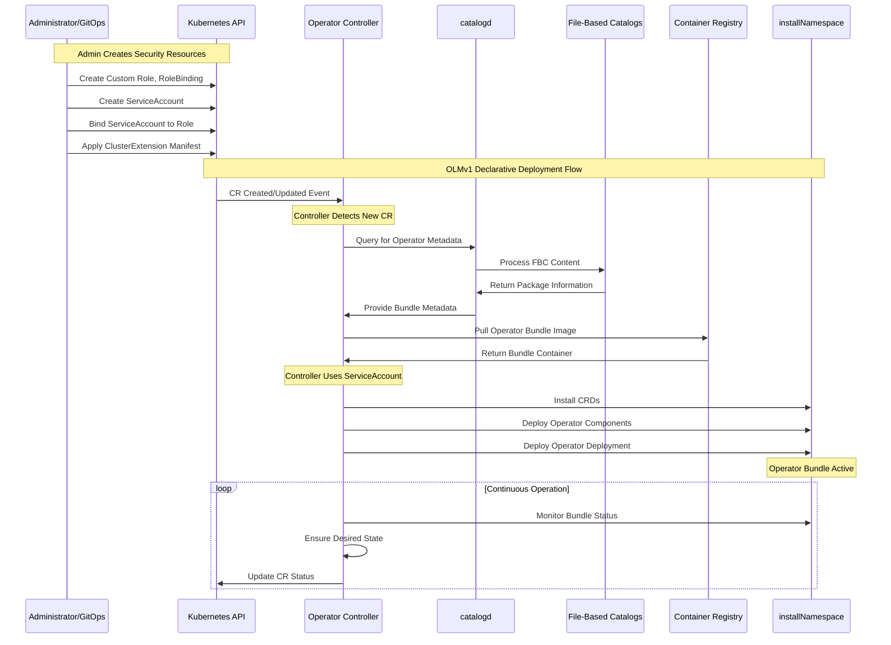

# Operator Lifecycle Manager V1 (OLMv1)

> **Disclaimer**: This repo contains AI-generated content using Cursor / Gemini AI.

## Table of Contents

- [Overview](#overview)
- [Architecture](#architecture)
- [Key Components](#key-components)
- [Deployment Flow](#deployment-flow)
- [Sequence Diagram](#sequence-diagram)
- [Project Structure](#project-structure)
- [Deployment Documentation](#deployment-documentation)
- [Using Templates](#using-templates)
- [RBAC Manager Tool](#rbac-manager-tool)
- [Documentation](#documentation)

## Overview

The Operator Lifecycle Manager V1 (OLMv1) is a declarative, pull-based system designed for managing Kubernetes operators with a focus on simplicity and security. This document provides a comprehensive guide to understanding OLMv1's architecture, deployment flow, and practical usage.

## Architecture

OLMv1 follows a declarative architecture where administrators define desired states through Custom Resources, and the system automatically orchestrates operator lifecycles. The architecture is built around several core components that work together to provide a robust operator management solution.

## Key Components

| Component | Description | Purpose |
|-----------|-------------|---------|
| **Administrator/GitOps Tool** | Human operator or automation tool | Creates ClusterExtension CRs to define desired operator states |
| **Operator Controller** | Core OLMv1 component | Watches ClusterExtension CRs and orchestrates operator lifecycle |
| **catalogd** | Metadata service | Hosts and serves operator metadata from File-Based Catalogs |
| **File-Based Catalogs (FBCs)** | Lightweight metadata collections | Source of truth for operator bundles, channels, and update graphs |
| **Installed Operator Bundle** | Deployed operator resources | Includes deployment, ServiceAccount, RBAC, and CRDs |

## Deployment Flow

The OLMv1 deployment process follows a logical sequence:

1. **Administrator Action**: Apply a declarative `ClusterExtension` manifest specifying the desired operator package, version, and target namespace
2. **Controller Detection**: The Operator Controller detects the new `ClusterExtension` CR
3. **Metadata Query**: Controller queries `catalogd` for the requested operator bundle
4. **Catalog Response**: `catalogd` provides metadata from File-Based Catalogs
5. **Bundle Deployment**: Controller pulls and deploys the operator bundle components
6. **Active Operation**: Operator begins operation with optimized RBAC permissions

## Sequence Diagram



## Project Structure

This project provides a structured approach for deploying OLMv1 operators with proper security and RBAC configuration:

```tree
OLMv1/
├── .github/                           # GitHub-specific configuration
│   ├── workflows/                     # GitHub Actions CI/CD workflows
│   ├── ISSUE_TEMPLATE/               # Issue templates
│   ├── PULL_REQUEST_TEMPLATE.md      # Pull request template
│   └── markdown-link-check-config.json # Link checker config
├── docs/                              # Project documentation
│   ├── API.md                        # API reference documentation
│   ├── COMMAND_REFERENCE.md          # OPM and catalogd command reference
│   ├── DEPLOYMENT.md                 # Deployment instructions
│   └── PROJECT_STRUCTURE.md          # Repository organization guide
├── examples/                          # Example configurations and use cases
│   ├── helm/                         # Example Helm values files
│   │   ├── additional-resources-example.yaml # Additional resources example
│   │   ├── rbac-only-example.yaml    # RBAC-only deployment example
│   │   └── values-quay-operator.yaml # Quay operator Helm values
│   ├── rbac-manager/                 # RBAC Manager tool output examples
│   │   └── generated-files/          # Generated RBAC files with DRY deduplication
│   │       ├── argocd-operator-clusterrole-*.yaml # Generated ClusterRole with deduplication
│   │       ├── argocd-operator-clusterrolebinding-*.yaml # Generated ClusterRoleBinding
│   │       ├── argocd-operator-role-*.yaml # Generated Role (deduplicated)
│   │       ├── argocd-operator-rolebinding-*.yaml # Generated RoleBinding
│   │       ├── argocd-operator-serviceaccount-*.yaml # Generated ServiceAccount
│   │       └── post-installation/    # Post-installation hardening examples
│   └── yamls/                        # Example Kubernetes YAML files
│       ├── 00-namespace.yaml         # Namespace definition
│       ├── 01-serviceaccount.yaml    # Service account for operator
│       ├── 02-clusterrole.yaml       # Cluster role with optimized permissions
│       ├── 03-clusterrolebinding.yaml # Cluster role binding
│       └── 04-clusterextension.yaml  # OLMv1 ClusterExtension
├── helm/                             # Helm chart for OLMv1 deployment
│   ├── Chart.yaml                    # Helm chart metadata
│   ├── values.yaml                   # Default values
│   └── templates/                    # Helm templates
│       ├── _helpers.tpl              # Template helpers
│       ├── clusterextension.yaml     # ClusterExtension template
│       ├── clusterrole.yaml          # ClusterRole template
│       ├── role.yaml                 # Role template
│       ├── serviceaccount.yaml       # ServiceAccount template
│       └── NOTES.txt                 # Post-install notes
├── templates/                        # Kubernetes resource templates
│   ├── CustomRoles/                  # Custom RBAC templates
│   │   ├── 00-rolebinding.yaml       # Role binding template
│   │   ├── 01-clusterrole.yaml       # Cluster role template
│   │   └── 02-clusterrolebinding.yaml # Cluster role binding template
│   └── OLMv1 Resources/              # Core OLMv1 resource templates
│       ├── 01-clustercatalog.yaml    # ClusterCatalog example
│       └── 02-clusterextension.yaml  # ClusterExtension example
├── tools/                            # Development and management tools
│   └── rbac-manager/                 # RBAC Manager tool
│       ├── rbac-manager/             # Main tool package
│       │   ├── help/                 # Help text files
│       │   │   ├── catalogd_help.txt # Catalogd command help
│       │   │   ├── examples_help.txt # Comprehensive examples
│       │   │   ├── main_help.txt     # Main command help
│       │   │   └── opm_help.txt      # OPM command help
│       │   └── libs/                 # Core libraries
│       │       ├── catalogd/         # Catalogd integration
│       │       │   ├── cache.py      # Caching functionality
│       │       │   ├── client.py     # Low-level catalogd client
│       │       │   ├── parser.py     # Response parsing
│       │       │   ├── service.py    # High-level service
│       │       │   └── session.py    # Session management
│       │       ├── core/             # Core utilities
│       │       │   ├── auth.py       # Authentication handling
│       │       │   ├── config.py     # Configuration management
│       │       │   ├── exceptions.py # Custom exceptions
│       │       │   └── utils.py      # Utility functions
│       │       ├── opm/              # OPM integration
│       │       │   ├── base_generator.py # Base generator with DRY deduplication logic
│       │       │   ├── client.py     # OPM binary client
│       │       │   ├── helm_generator.py # Helm values generator (deduplicated)
│       │       │   ├── processor.py  # Bundle processor
│       │       │   └── yaml_generator.py # YAML manifest generator (deduplicated)
│       │       ├── help_manager.py   # Help system manager
│       │       └── main_app.py       # Main application logic
│       ├── tests/                    # Test suite
│       │   └── test_catalogd.py      # Catalogd integration tests
│       ├── rbac-manager.py           # CLI entry point
│       ├── requirements.txt          # Python dependencies
│       └── README.md                 # Tool documentation
├── config/                           # Configuration files (future use)
├── scripts/                          # Utility scripts (future use)
├── tests/                            # Test files (future use)
├── workflows/                        # Workflow definitions (future use)
├── CHANGELOG.md                      # Project changelog
├── CONTRIBUTING.md                   # Contribution guidelines
├── LICENSE                           # MIT license
└── README.md                         # This documentation
```

## Deployment Documentation

For detailed deployment instructions, including step-by-step processes, cleanup procedures, and Helm chart usage, see the comprehensive [Deployment Guide](docs/DEPLOYMENT.md).

The guide covers:

- **Step-by-step deployment** of operators using YAML manifests
- **Helm chart deployment** for simplified operator installation
- **Cleanup procedures** for removing operators and resources
- **Monitoring and verification** steps for successful deployments

## Using Templates

The `templates/CustomRoles/` directory contains reusable templates for custom RBAC configurations that can be adapted for different operators.

## RBAC Manager Tool

The project includes an advanced RBAC Manager tool (`tools/rbac-manager/`) that automates the extraction and processing of RBAC permissions from OLM operators. This tool significantly simplifies the process of creating proper security configurations for OLMv1 deployments.

### Quick Start

```bash
# Navigate to the tool directory
cd tools/rbac-manager/

# Create and activate virtual environment (recommended)
python3 -m venv rbac-manager-env
source rbac-manager-env/bin/activate  # On Linux/macOS
# rbac-manager-env\Scripts\activate   # On Windows

# Install dependencies
pip install -r requirements.txt

# Get help for specific commands
python3 rbac-manager.py --catalogd --help
python3 rbac-manager.py --opm --help

# View comprehensive examples
python3 rbac-manager.py --examples

# Extract RBAC for an operator using OPM workflow
python3 rbac-manager.py --opm --image registry.redhat.io/quay/quay-operator-bundle@sha256:c431ad9dfd69c049e6d9583928630c06b8612879eeed57738fa7be206061fee2 --helm

# Save RBAC files for later use
python3 rbac-manager.py --opm --image <bundle-image> --output ./rbac-files

# Generate YAML manifests (default)
python3 rbac-manager.py --opm --image <bundle-image>

# Generate Helm values with security notices
python3 rbac-manager.py --opm --image <bundle-image> --helm
```

### Benefits for OLMv1 Deployment

1. **Smart RBAC Logic**: Correctly handles different permission patterns:
   - **Both `clusterPermissions` + `permissions`**: ClusterRoles + grantor Roles (e.g., ArgoCD)
   - **Only `permissions`**: Treat as ClusterRoles (e.g., Quay operator)
   - **Only `clusterPermissions`**: ClusterRoles only
2. **Kubernetes-Native Output**: Generates proper Kubernetes RBAC YAML with consistent naming
3. **Helm Integration**: Mixed block/flow YAML style with comprehensive security notices
4. **DRY Deduplication**: Advanced permission deduplication eliminates redundant RBAC rules between ClusterRoles and Roles
5. **Microservice Architecture**: Clean BundleProcessor orchestrator with separated concerns
6. **Live Catalog Access**: Query catalogd directly for real-time operator bundle information
7. **Automation Ready**: Supports scripting and CI/CD integration for GitOps workflows

### DRY Deduplication Features

The RBAC Manager now includes intelligent **DRY (Don't Repeat Yourself)** deduplication that automatically:

- **🔍 Detects Redundancy**: Identifies when Role permissions are already covered by ClusterRole permissions
- **🎯 Preserves Specificity**: Keeps resource-specific rules with `resourceNames` even when broader permissions exist  
- **⚡ Handles Wildcards**: Recognizes when wildcard permissions (`verbs: ['*']`) supersede specific permissions
- **🧹 Reduces Complexity**: Eliminates duplicate RBAC rules for cleaner, more maintainable configurations
- **🔒 Enhances Security**: Reduces permission conflicts and improves overall security posture

**Example**: If a ClusterRole grants `['*']` verbs on `[configmaps, services]`, the tool automatically removes redundant Role rules for those same resources, keeping only resource-specific rules with `resourceNames`.

### Integration with OLMv1 Workflow

The RBAC Manager integrates seamlessly with the OLMv1 deployment process:

1. **Discover Operators**: Query available catalogs and packages using catalogd integration
2. **Generate Configuration**: Create reusable configuration templates or extract live metadata from catalogd
3. **Extract RBAC**: Use the tool to extract required permissions for your chosen operator
4. **Review Permissions**: Examine the generated RBAC to ensure it meets security requirements
5. **Deploy RBAC**: Apply the RBAC resources before deploying the ClusterExtension
6. **Deploy Operator**: Use the generated ServiceAccount in your ClusterExtension manifest

#### Configuration File Workflows

```bash
# Create OPM configuration template for team reuse
python3 rbac_manager.py --generate-config ~/.team-rbac-config.yaml --opm

# Extract live metadata from catalogd for specific operator version
python3 rbac_manager.py --generate-config ./operator-metadata.json \
  --catalogd --package prometheus --channel stable --version v0.47.0 \
  --catalog-name operatorhubio --insecure

# Use configuration for streamlined RBAC extraction
python3 rbac_manager.py --config ~/.team-rbac-config.yaml --opm \
  --image <bundle-from-metadata> --helm
```

For comprehensive usage instructions, examples, and troubleshooting guides, see the [RBAC Manager Documentation](tools/rbac-manager/README.md).

## Documentation

This project includes comprehensive documentation to help you understand and use OLMv1 effectively:

### Core Documentation

- **[Deployment Guide](docs/DEPLOYMENT.md)**: Step-by-step instructions for deploying operators with OLMv1
- **[API Reference](docs/API.md)**: Complete API documentation for all components
- **[Command Reference](docs/COMMAND_REFERENCE.md)**: Practical OPM and catalogd commands for operator analysis
- **[Project Structure](docs/PROJECT_STRUCTURE.md)**: Repository organization and development guidelines

### Tool Documentation

- **[RBAC Manager Tool](tools/rbac-manager/README.md)**: Automated RBAC extraction and management with configuration support

### Quick References

- **Package Discovery**: Use `opm render` or catalogd API to find available operators
- **RBAC Extraction**: Leverage the RBAC Manager tool for automated permission analysis
- **Deployment**: Follow the deployment guide for production-ready operator installations
- **Troubleshooting**: Check the command reference for debugging techniques

> **💡 Tip**: For easier operator management, start with the [RBAC Manager Tool](tools/rbac-manager/) which automates many manual processes and provides a user-friendly interface for OLMv1 workflows.
